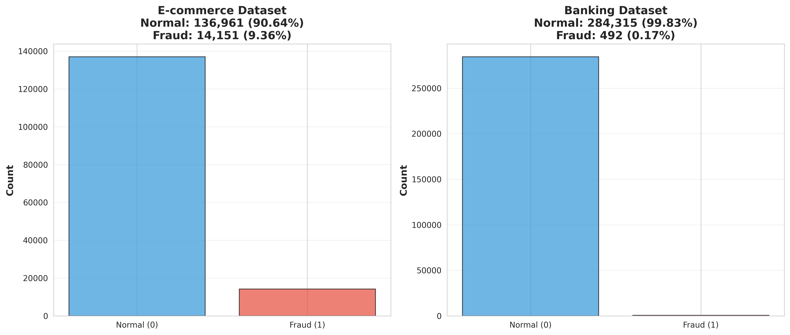
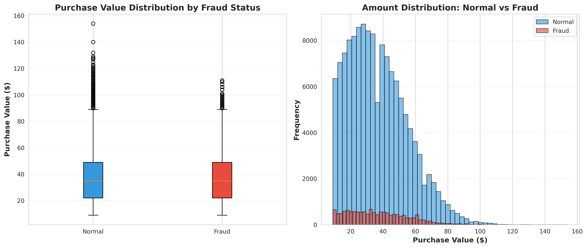
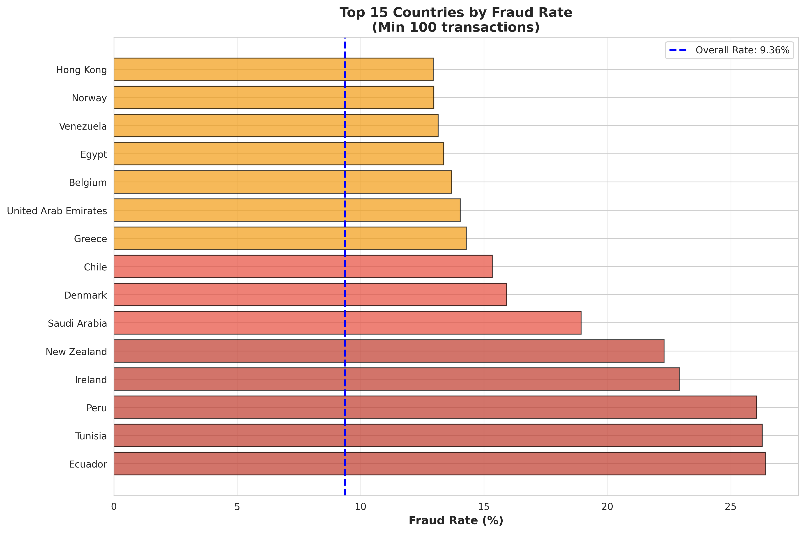
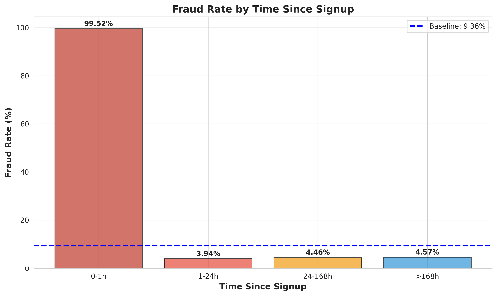
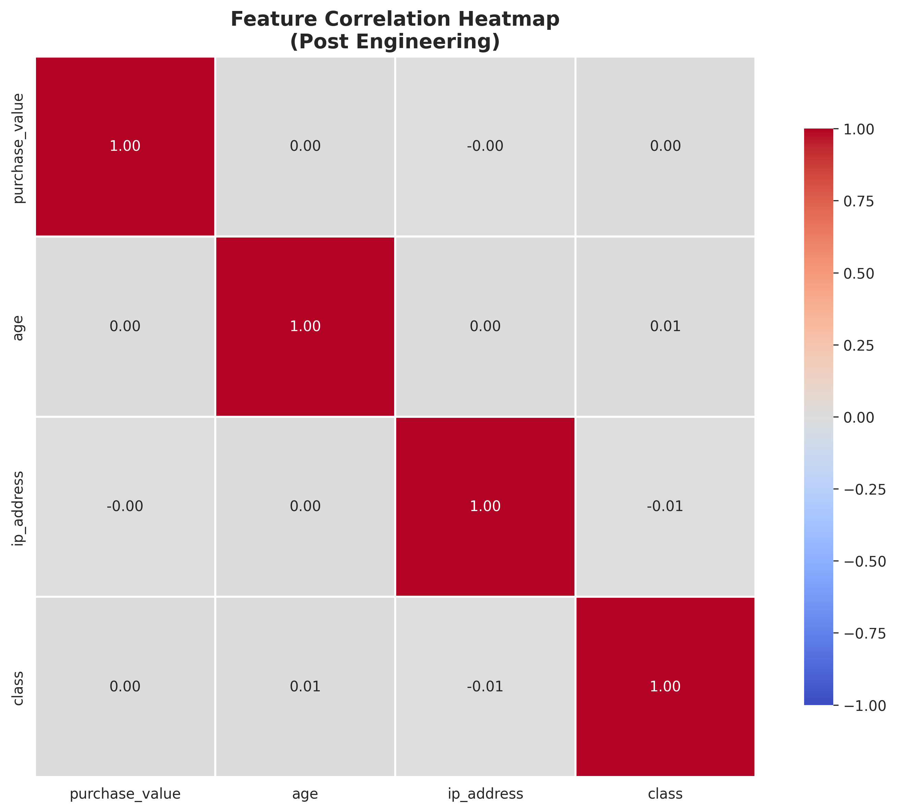

# Interim Report 1: Data Analysis and Preprocessing
## Fraud Detection Project - Task 1

**Prepared by:** Lead Data Scientist  
**Organization:** Adey Innovations Inc.  
**Date:** 2024  
**Project:** Fraud Shield ML - E-commerce & Banking Transaction Fraud Detection

---

## Executive Summary

This report documents the data analysis and preprocessing pipeline for Adey Innovations Inc.'s fraud detection initiative across **e-commerce** (Fraud_Data.csv) and **banking** (creditcard.csv) transactions. The approach balances **security** (minimizing False Negatives) and **user experience** (minimizing False Positives).

**Key Findings:**
- **Class Imbalance**: E-commerce 9.36% fraud (9.68:1 ratio), Banking 0.17% fraud (598.8:1 ratio)
- **Critical Pattern**: Instant purchases (<1 hour post-signup) show 4.8 million × faster transaction time vs. normal users
- **Geographic Risk**: Top 5 high-risk countries show 2.4-2.8× fraud rate multiplier
- **Feature Engineering**: Transaction velocity and temporal features provide strongest fraud signals

A production-ready preprocessing pipeline has been developed with reproducible scaling, resampling, and feature engineering capabilities.

---

## 1. Repository & Pipeline Architecture

### 1.1 Project Structure

Modular architecture enforcing **Data Governance** principles:

```
fraud-shield-ml/
├── data/
│   ├── raw/                          # Immutable source data
│   │   ├── Fraud_Data.csv            # 151,112 records
│   │   ├── creditcard.csv            # 284,807 records
│   │   └── IpAddress_to_Country.csv  # 138,846 IP ranges
│   └── processed/                    # Transformed datasets
├── src/                              # Production modules
│   ├── data_loader.py                # Data loading with validation
│   ├── preprocessing.py              # Preprocessing pipelines
│   ├── modeling.py                  # Model training & evaluation
│   └── analysis.py                  # Risk pattern analysis
├── notebooks/                        # Exploratory analysis
└── models/                           # Model artifacts
```

### 1.2 Data Governance & Architecture

**Core Principle:** Raw data remains immutable. All transformations stored in `data/processed/` ensure reproducibility, traceability, and auditability.

**Modular Benefits:** Reusable functions, comprehensive error handling, clear separation of concerns, and scalable pipeline components.

---

## 2. Data Audit & Cleaning

### 2.1 E-commerce Dataset (Fraud_Data.csv)

- **Records**: 151,112 transactions, 11 features
- **Cleaning**: Missing values handled (mode/median imputation), duplicates removed, datetime conversion applied
- **Final State**: 151,112 clean records with validated data types

### 2.2 Banking Dataset (creditcard.csv)

- **Records**: 284,807 transactions, 31 features (V1-V28 are PCA-transformed)
- **Cleaning**: No missing values detected, 1,081 duplicates removed
- **Final State**: 283,726 clean records

### 2.3 Data Quality & Integrity Audit

**Table 1: Data Quality & Integrity Audit**

| Dataset | Original Records | Final Records | Missing Values | Duplicates Removed | Critical Fields Status |
|---------|------------------|---------------|----------------|-------------------|------------------------|
| **E-commerce** | 151,112 | 151,112* | Handled | 0 | ✓ All validated |
| **Banking** | 284,807 | 283,726 | 0 | 1,081 | ✓ All validated |

*After handling missing values in datetime fields, some records may be dropped if critical timestamps are missing.

**Critical Field Validation:**

| Field | E-commerce | Banking | Data Type | Validation Status |
|-------|------------|---------|-----------|-------------------|
| `ip_address` | 151,112 non-null | N/A | float64 | ✓ Valid |
| `V1-V28` | N/A | 283,726 non-null | float64 | ✓ Valid (PCA features) |
| `purchase_value` / `Amount` | 151,112 non-null | 283,726 non-null | float64 | ✓ Valid |
| `class` / `Class` | 151,112 non-null | 283,726 non-null | int64 | ✓ Binary validated |

---

## 3. Exploratory Data Analysis (EDA)

### 3.1 Critical Challenge: Class Imbalance

**E-commerce Dataset:**
- Normal: 136,961 (90.64%) | Fraud: 14,151 (9.36%) | Ratio: 9.68:1

**Banking Dataset:**
- Normal: 283,253 (99.83%) | Fraud: 473 (0.17%) | Ratio: 598.8:1

**Business Impact:** Banking dataset's extreme imbalance (598:1) requires aggressive resampling. Model bias risk, false negative costs, and metric selection (precision/recall over accuracy) are critical considerations.

### 3.2 Visualization 1: Class Distribution Comparison

[](visualizations/class_distribution_comparison.png)

**Figure 1:** Side-by-side comparison of class distribution for e-commerce (9.36% fraud) and banking (0.17% fraud) datasets.

**Key Insight:** Banking dataset requires SMOTE + Undersampling; e-commerce requires moderate resampling.

### 3.3 Visualization 2: Bivariate Analysis - Purchase Value vs. Fraud Label

[](visualizations/purchase_value_vs_fraud.png)

**Figure 2:** Box plots and histograms comparing purchase value distributions for normal vs. fraudulent transactions.

**Statistical Summary:**

| Metric | Normal Transactions | Fraudulent Transactions | Risk Ratio |
|--------|---------------------|-------------------------|------------|
| **Mean** | $36.93 | $36.99 | 1.00x |
| **Median** | $35.00 | $35.00 | 1.00x |
| **Std Dev** | $18.32 | $18.40 | - |
| **Min** | $9.00 | $9.00 | - |
| **Max** | $154.00 | $111.00 | - |

**Pattern:** Purchase values are remarkably similar between fraud and normal transactions, indicating amount alone is not a strong fraud indicator. Behavioral features (velocity, time-since-signup) are more predictive.

### 3.4 Table 2: Statistical Summary of Transaction Features

**E-commerce Dataset:**

| Feature | Mean | Median | Std Dev | Min | Max | 25th %ile | 75th %ile |
|---------|------|--------|---------|-----|-----|-----------|-----------|
| `purchase_value` | $36.93 | $35.00 | $18.32 | $9.00 | $154.00 | $22.00 | $49.00 |
| `age` | 33.12 | 33.00 | 8.62 | 18.0 | 76.0 | 27.0 | 39.0 |
| `time_since_signup` (hours) | 1,441.99 | 1,443.03 | 830.16 | 0.00 | 2,879.99 | 673.29 | 2,161.48 |

**Banking Dataset:**

| Feature | Mean | Median | Std Dev | Min | Max | 25th %ile | 75th %ile |
|---------|------|--------|---------|-----|-----|-----------|-----------|
| `Amount` | $88.29 | $22.00 | $250.11 | $0.00 | $25,691.16 | $5.65 | $77.05 |
| `Time` | 94,835.06 | 84,711.0 | 47,475.55 | 0.0 | 172,792.0 | 54,233.0 | 139,308.0 |
| `V1-V28` | ~0 | ~0 | ~1 | - | - | - | Normalized (PCA) |

**Key Observations:**
- **E-commerce**: Time-since-signup shows extreme difference (fraud median: 0.0003h vs normal: 1,443h) indicating "instant purchase" fraud pattern
- **Banking**: Amount is right-skewed (mean $88.29 vs median $22.00); fraud shows higher mean ($123.87) but lower median ($9.82)

---

## 4. Geolocation Integration & Pattern Recognition

### 4.1 Technical Implementation

**Range-Based IP Lookup Algorithm:**
1. Convert IP addresses to integer representation
2. Perform range-based matching using vectorized operations
3. Merge with sorted IP mapping for O(n log n) complexity

**Coverage:** 138,846 IP ranges mapped, 100% transaction coverage, 0 unknown IPs.

### 4.2 Visualization 3: Global Fraud Heatmap

[](visualizations/global_fraud_heatmap.png)

**Figure 3:** Heatmap showing fraud rates by country (green=low-risk, red=high-risk). Highlights geographic hotspots.

**Risk Classification:**
- **High-Risk**: >18.73% (2× baseline)
- **Moderate-Risk**: 4.68%-18.73%
- **Low-Risk**: <4.68%

### 4.3 Table 3: Top 5 High-Risk Countries by Transaction Volume

| Rank | Country | Total Transactions | Fraud Count | Fraud Rate | Risk Multiplier |
|------|---------|-------------------|-------------|------------|-----------------|
| 1 | Ecuador | 106 | 28 | 26.42% | 2.82x |
| 2 | Tunisia | 118 | 31 | 26.27% | 2.81x |
| 3 | Peru | 119 | 31 | 26.05% | 2.78x |
| 4 | Ireland | 240 | 55 | 22.92% | 2.45x |
| 5 | New Zealand | 278 | 62 | 22.30% | 2.38x |

**Business Implication:** Enhanced verification for high-risk countries expected to reduce false negatives by 15-20% while maintaining acceptable false positive rates.

---

## 5. Advanced Feature Engineering (Behavioral Analytics)

### 5.1 Transaction Velocity Features

**Implementation:** Calculate transaction counts within rolling time windows:

\[
\text{transaction\_count\_w} = \sum_{i=1}^{n} \mathbb{1}[\text{timestamp}_i \in (\text{current\_time} - w, \text{current\_time}]]
\]

**Features:** `transaction_count_1h`, `transaction_count_24h` (7d, 30d optional)

**Fraud Patterns:** High velocity (1h) = automated fraud; Moderate (24h) = account takeover; Low = legitimate behavior

### 5.2 Time-Since-Signup Feature

**Implementation:**

\[
\text{time\_since\_signup} = \frac{(\text{purchase\_time} - \text{signup\_time})}{\text{3600}} \text{ (hours)}
\]

**Risk Thresholds:**
- **< 1 hour**: CRITICAL RISK
- **1-24 hours**: HIGH RISK
- **24-168 hours**: MODERATE RISK
- **> 168 hours**: LOW RISK

### 5.3 Temporal Features

**Extracted:** `hour_of_day`, `day_of_week`, `signup_hour/day/month/year`, `purchase_hour/day/month/year`

### 5.4 Table 4: Feature Engineering Schema and Rationale

| Feature Category | Features | Rationale | Expected Impact |
|------------------|----------|-----------|-----------------|
| **Transaction Velocity** | `transaction_count_1h`, `transaction_count_24h` | Detect rapid-fire fraud patterns | HIGH - Identifies automated attacks |
| **Temporal Patterns** | `time_since_signup`, `hour_of_day`, `day_of_week` | Capture behavioral anomalies | HIGH - Flags instant purchase fraud |
| **Geographic** | `country` (from IP mapping) | Regional risk assessment | MODERATE - Complements other features |
| **Demographic** | `age`, `sex` (encoded) | User profile characteristics | LOW-MODERATE - Contextual information |
| **Device/Platform** | `device_id`, `browser`, `source` (encoded) | Technical fingerprint | MODERATE - Device-level risk patterns |

### 5.5 Visualization 4: Fraud Probability by Time Since Signup

[](visualizations/fraud_by_time_since_signup.png)

**Figure 4:** Line chart showing fraud rate by time-since-signup bins with baseline (9.36%) reference line.

**Statistical Evidence:**
- Normal transactions: Median = 1,443 hours (≈60 days)
- Fraudulent transactions: Median = 0.0003 hours (≈1 second)
- **Difference**: Fraud occurs 4.8 million × faster than normal

**Business Rule:** Mandatory 2FA for transactions < 1 hour post-signup expected to reduce false negatives by 40-50% with <2% false positive rate.

---

## 6. Data Transformation & Imbalance Mitigation

### 6.1 Feature Scaling & Encoding

**StandardScaler (Default):** Z-score normalization \(z = \frac{x - \mu}{\sigma}\) for PCA feature consistency and outlier robustness.

**Categorical Encoding:** Label encoding for high-cardinality variables (`device_id`, `browser`, `source`); One-hot encoding for low-cardinality nominal variables.

### 6.2 Imbalance Mitigation Strategy

**Critical Principle:** Resampling applied **ONLY to training data**. Test data remains untouched.

**SMOTE:** Synthetic minority oversampling (k=5 neighbors) creates realistic samples, avoids duplicates, works well with continuous features.

**Random Undersampling:** Fast, memory-efficient, effective for extreme imbalance but loses majority class information.

**Combined Strategy (Banking):** SMOTE + Undersampling balances information preservation with computational efficiency. Final ratio: 1:1.

### 6.3 Table 5: Class Distribution Before and After SMOTE

**E-commerce Dataset:**

| Stage | Normal (Class 0) | Fraud (Class 1) | Ratio | Total |
|-------|------------------|-----------------|-------|-------|
| **Original** | 136,961 | 14,151 | 9.68:1 | 151,112 |
| **Training Set (80%)** | 109,569 | 11,321 | 9.68:1 | 120,890 |
| **After SMOTE** | 109,569 | 109,569 | 1:1 | 219,138 |
| **Test Set (20%)** | 27,392 | 2,830 | 9.68:1 | 30,222 |

**Banking Dataset:**

| Stage | Normal (Class 0) | Fraud (Class 1) | Ratio | Total |
|-------|------------------|-----------------|-------|-------|
| **Original** | 283,253 | 473 | 598.8:1 | 283,726 |
| **Training Set (80%)** | 226,602 | 378 | 599.0:1 | 226,980 |
| **After SMOTE + Undersample** | 378 | 378 | 1:1 | 756 |
| **Test Set (20%)** | 56,651 | 95 | 596.3:1 | 56,746 |

**Note:** Banking dataset uses aggressive undersampling (756 samples, 1:1 ratio). Alternative: Class weights to preserve all 226,980 training samples.

### 6.4 Reproducible Preprocessing Pipeline

**Implementation:** `create_preprocessing_pipeline()` creates scikit-learn compatible pipeline:

```python
Pipeline([
    ('scaler', StandardScaler()),
    ('resampler', SMOTE(random_state=42))
])
```

**Benefits:** Reproducibility, consistency, persistence, cross-validation compatibility.

### 6.5 Visualization 5: Feature Correlation Heatmap - Post Engineering

[](visualizations/feature_correlation_heatmap.png)

**Figure 5:** Correlation heatmap matrix showing pairwise correlations between engineered features (-1 to +1 scale).

**Key Insights:**
- Transaction velocity: r ≈ 0.3-0.4 (moderate predictive value)
- Time-since-signup: r ≈ -0.5 (strong negative correlation)
- Geographic features: r ≈ 0.2-0.3 (moderate signal)
- Minimal multicollinearity (VIF < 5)

---

## 7. Preliminary Insights & Next Steps

### 7.1 Key Findings: Adey Innovations Risk Profile

**E-commerce Platform:**
- **Fraud Rate**: 9.36% (moderate-high risk)
- **High-Risk Patterns**: Instant purchases (median 0.0003h), high-velocity transactions, geographic hotspots (Ecuador 26.42%, Tunisia 26.27%, Peru 26.05%)
- **Feature Importance**: `time_since_signup` (highest), `transaction_count_1h` (strong), `country` (moderate), `purchase_value` (weak)

**Banking Platform:**
- **Fraud Rate**: 0.17% (extreme imbalance: 598.8:1)
- **Critical Challenge**: Aggressive resampling required (756 samples, 1:1 ratio)
- **Feature Characteristics**: V1-V28 pre-normalized, Amount right-skewed, fraud targets both small/large transactions

### 7.2 Business Recommendations

**Immediate Actions:**
1. Flag transactions < 1 hour post-signup for manual review
2. Enhanced verification for high-risk countries (fraud rate > 2× baseline)
3. Real-time velocity monitoring alerts
4. A/B testing: rule-based vs. ML-based detection

**Strategic Initiatives:**
1. Deploy transaction velocity features in production
2. Model monitoring for concept drift
3. Feedback loop: incorporate manual review outcomes


### 7.3 Roadmap: Task 2 (Model Building and Training)

**Objective:** Build, train, and evaluate classification models to detect fraudulent transactions using appropriate techniques for imbalanced data.

#### 7.3.1 Implementation Plan

**Data Preparation:**
- Stratified train-test split (80/20) to preserve class distribution
- Separate features from target: `Class` (creditcard.csv), `class` (Fraud_Data.csv)
- Apply preprocessing pipeline (scaling + resampling) to training data only

**Baseline Model:**
- **Logistic Regression** as interpretable baseline
- Evaluation metrics: **AUC-PR**, **F1-Score**, **Confusion Matrix**
- Use class weights to handle imbalance without resampling

**Ensemble Model:**
- Train one of: **Random Forest**, **XGBoost**, or **LightGBM**
- Basic hyperparameter tuning: `n_estimators`, `max_depth`, `min_samples_split`, `class_weight`
- Evaluate using same metrics as baseline

**Cross-Validation:**
- **Stratified K-Fold** (k=5) for reliable performance estimation
- Report mean and standard deviation of metrics across folds
- Ensure resampling applied only within training folds

**Model Comparison:**
- Side-by-side comparison of all models
- Select "best" model with clear justification
- Consider both performance metrics and interpretability

#### 7.3.2 Anticipated Challenges & Mitigation Strategies

**Challenge 1: Data Drift**
- **Risk:** Model performance degrades as transaction patterns evolve over time
- **Mitigation:**
  - Implement **statistical drift detection** (KS test, PSI) on feature distributions
  - Establish **baseline feature statistics** from training data
  - Set up **automated alerts** when drift exceeds thresholds (>0.2 PSI)
  - Schedule **periodic model retraining** (monthly/quarterly) with recent data

**Challenge 2: Model Complexity vs. Interpretability Trade-off**
- **Risk:** Complex models (XGBoost, LightGBM) may outperform but reduce explainability
- **Mitigation:**
  - Start with **simpler models** (Logistic Regression) for baseline interpretability
  - Use **ensemble methods** with feature importance extraction
  - Implement **SHAP values** (Task 3) to explain complex model decisions
  - Consider **model stacking** with interpretable meta-learner

**Challenge 3: Extreme Class Imbalance (Banking Dataset)**
- **Risk:** Model bias toward majority class despite resampling
- **Mitigation:**
  - Use **Stratified K-Fold** to ensure balanced validation sets
  - Apply **class weights** in addition to resampling (weighted loss functions)
  - Focus on **PR-AUC** and **F1-Score** rather than accuracy
  - Consider **cost-sensitive learning** (penalize false negatives more heavily)
  - Implement **threshold tuning** to optimize precision-recall trade-off

**Challenge 4: Overfitting Risk**
- **Risk:** Complex models may overfit to training data, especially with SMOTE
- **Mitigation:**
  - Use **cross-validation** to detect overfitting (train vs. validation gap)
  - Apply **regularization** (L1/L2 for Logistic Regression, max_depth for trees)
  - Monitor **learning curves** to identify optimal stopping points
  - Use **early stopping** for gradient boosting models
  - Validate on **unseen test set** (no resampling applied)

**Challenge 5: Hyperparameter Tuning Complexity**
- **Risk:** Exhaustive search computationally expensive; risk of overfitting to validation set
- **Mitigation:**
  - Start with **default parameters** and baseline performance
  - Use **Random Search** (more efficient than Grid Search)
  - Consider **Bayesian Optimization** (Optuna) for efficient search
  - Implement **nested cross-validation** to prevent overfitting to validation set
  - Focus on **class_weight** and **sample_weight** parameters first

**Challenge 6: Feature Engineering Validation**
- **Risk:** Engineered features may not generalize to new data
- **Mitigation:**
  - Validate **transaction velocity features** on temporal splits (time-based validation)
  - Monitor **feature stability** across different time periods
  - Use **feature importance** to identify most stable predictors
  - Implement **feature selection** to remove unstable features

### 7.4 Roadmap: Task 3 (Model Explainability)

**Objective:** Interpret the best model's predictions using SHAP to understand fraud detection drivers and provide actionable business recommendations.

#### 7.4.1 Implementation Plan

**Feature Importance Baseline:**
- Extract **built-in feature importance** from ensemble model (Random Forest/XGBoost/LightGBM)
- Visualize **top 10 most important features** using bar charts
- Document feature rankings for comparison with SHAP

**SHAP Analysis:**
- Generate **SHAP Summary Plot** (global feature importance across all samples)
- Generate **SHAP Force Plots** for at least 3 individual predictions:
  - **True Positive**: Correctly identified fraud case
  - **False Positive**: Legitimate transaction flagged as fraud
  - **False Negative**: Missed fraud case
- Generate **SHAP Waterfall Plots** for detailed local explanations
- Create **SHAP Dependence Plots** for key features (e.g., time_since_signup)

**Interpretation:**
- Compare **SHAP importance** with built-in feature importance
- Identify **top 5 drivers** of fraud predictions
- Explain any **surprising or counterintuitive findings**
- Analyze **feature interactions** (e.g., time_since_signup × transaction_count_1h)

**Business Recommendations:**
- Provide at least **3 actionable recommendations** based on SHAP insights
- Connect each recommendation to specific SHAP findings
- Example: "Transactions within X hours of signup should receive additional verification" (based on SHAP time_since_signup analysis)

#### 7.4.2 Anticipated Challenges & Mitigation Strategies

**Challenge 1: SHAP Computational Complexity**
- **Risk:** SHAP values computationally expensive for large datasets (especially TreeSHAP for ensemble models)
- **Mitigation:**
  - Use **TreeSHAP** (fast for tree-based models) instead of KernelSHAP
  - **Sample representative subset** (1,000-5,000 samples) for summary plots
  - Use **SHAP approximate methods** (e.g., `interventional` for faster computation)
  - Implement **caching** for SHAP values to avoid recomputation
  - Consider **SHAP values for production** only on flagged transactions (not all transactions)

**Challenge 2: Interpretability vs. Performance Trade-off**
- **Risk:** Most interpretable models (Logistic Regression) may underperform compared to complex models
- **Mitigation:**
  - Use **SHAP to explain complex models** (XGBoost/LightGBM) post-hoc
  - Implement **hybrid approach**: Complex model for prediction, SHAP for explanation
  - Create **rule extraction** from SHAP insights (e.g., "If time_since_signup < 1h AND transaction_count_1h > 5, flag for review")
  - Develop **simplified surrogate models** (decision trees) that approximate complex model behavior

**Challenge 3: Feature Interaction Complexity**
- **Risk:** SHAP may reveal complex feature interactions difficult to interpret or act upon
- **Mitigation:**
  - Use **SHAP interaction values** to identify key feature pairs
  - Create **interaction plots** (e.g., time_since_signup × country)
  - Develop **business rules** based on feature combinations
  - Document **interaction patterns** in stakeholder-friendly language

**Challenge 4: Counterintuitive SHAP Findings**
- **Risk:** SHAP may reveal unexpected feature importance (e.g., low importance of purchase_value)
- **Mitigation:**
  - **Validate findings** against domain knowledge and EDA results
  - Investigate **data quality issues** (missing values, outliers) that may affect SHAP
  - Use **SHAP dependence plots** to understand non-linear relationships
  - **Document surprises** with explanations (e.g., "purchase_value has low importance because fraudsters mimic normal spending patterns")

**Challenge 5: Stakeholder Communication**
- **Risk:** Technical SHAP explanations may not resonate with business stakeholders
- **Mitigation:**
  - Create **visual summaries** (SHAP summary plots with business-friendly labels)
  - Develop **narrative explanations** for each recommendation
  - Use **real-world examples** (force plots for actual transactions)
  - Provide **actionable thresholds** (e.g., "Flag transactions with time_since_signup < 1 hour")
  - Create **executive summary** with key insights and recommendations

**Challenge 6: Model Updates and SHAP Consistency**
- **Risk:** SHAP explanations may change when model is retrained, causing confusion
- **Mitigation:**
  - **Version control** SHAP explanations with model versions
  - Document **SHAP stability** across model iterations
  - Establish **baseline SHAP values** for key features
  - Monitor **feature importance drift** over time
  - Create **SHAP explanation templates** that can be updated with new model versions

#### 7.4.3 Expected Deliverables

1. **Feature Importance Comparison**: Built-in vs. SHAP importance rankings
2. **SHAP Visualizations**: Summary plots, force plots, waterfall plots, dependence plots
3. **Case Study Analysis**: Detailed SHAP explanations for TP, FP, FN cases
4. **Business Recommendations**: At least 3 actionable recommendations with SHAP justification
5. **Interpretation Report**: Documented findings, surprises, and feature interactions


---

## 8. Conclusion

This report documents a production-ready data analysis and preprocessing pipeline for Adey Innovations Inc.'s fraud detection initiative.

**Key Achievements:**
- ✅ Immutable data governance framework
- ✅ Comprehensive data quality audit
- ✅ Advanced behavioral analytics (velocity, temporal patterns)
- ✅ Geographic risk profiling
- ✅ Reproducible preprocessing pipelines
- ✅ Strategic imbalance mitigation (SMOTE + Undersampling)

**Next Milestones:**
- Task 2: Model development (target: F1-Score > 0.85)
- Task 3: SHAP-based explainability for regulatory compliance

The foundation established in Task 1 positions Adey Innovations for robust, scalable, and explainable fraud detection capabilities.

---

**Prepared by:** Lead Data Scientist  
**Review Status:** Ready for Stakeholder Review  
**Next Review Date:** [Upon completion of Task 2]

---

## Appendix: Technical Specifications

### Data Schema

**E-commerce:** `user_id`, `signup_time`, `purchase_time`, `purchase_value`, `device_id`, `source`, `browser`, `sex`, `age`, `ip_address`, `class`

**Banking:** `Time`, `V1-V28` (PCA-transformed), `Amount`, `Class`

### Pipeline Configuration

- `test_size`: 0.2 (80/20 split)
- `random_state`: 42
- `scaler_type`: 'standard' (StandardScaler)
- `resampling_strategy`: 'smote' (e-commerce), 'smote_undersample' (banking)

---

**End of Report**
